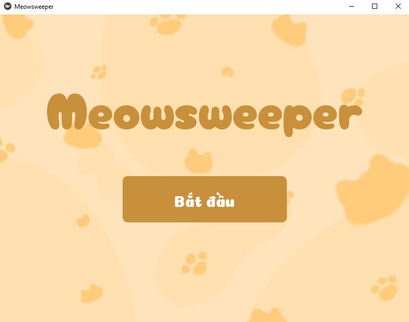
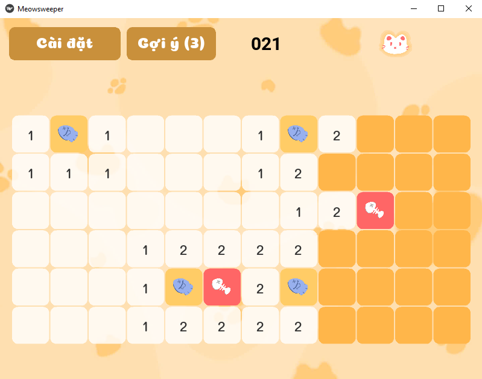

# 🐾 Meowsweeper - Game Dò Mìn Phong Cách Mèo


Meowsweeper là một tựa game giải đố được làm lại từ huyền thoại Minesweeper (Dò mìn) nhưng với giao diện UI tùy chỉnh cực kỳ đáng yêu, cùng hệ thống Trí tuệ nhân tạo (AI) tích hợp sẵn để hỗ trợ người chơi.

## 📖 Cốt truyện
Meo Meo là một bé mèo trắng nhỏ nhắn và vô cùng háu ăn. Gia tài lớn nhất của cậu chàng là những chú cá thơm ngon được cất giấu cẩn thận khắp nơi. Thế nhưng, thế giới loài mèo đâu có đơn giản! Xung quanh luôn có những gã mèo hoang ranh mãnh rình rập, chỉ chờ Meo Meo sơ hở là lao ra cướp sạch bữa ăn ngon.

Hãy dùng tư duy logic của bạn để hóa thân thành "vệ sĩ", dựa vào các con số để tìm và cắm cờ (🐟) bảo vệ kho cá cho Meo Meo. Cẩn thận nhé, nếu lỡ tay lật nhầm ô có giấu cá, bọn mèo hoang sẽ xông ra ăn sạch và chỉ để lại bộ xương khô (🦴) khiến bé mèo của chúng ta mất đi một nhịp tim đấy!

## 📸 Hình ảnh trò chơi
*(Thêm ảnh chụp màn hình game của bạn vào đây)*




## ✨ Tính năng nổi bật

### 1. Trí tuệ nhân tạo (AI Assistant) siêu tốc
* **Hệ thống suy luận:** Sử dụng bài toán Thỏa mãn Ràng buộc (CSP) để thu thập dữ kiện từ bàn cờ.
* **Tối ưu hóa Vét cạn (Pruning Backtracking):** AI sử dụng kỹ thuật "Cắt tỉa nhánh" kết hợp "Cửa sổ trượt" (Sliding Window) để chặt đứt các nhánh logic sai ngay từ sớm. Nhờ vậy, AI có thể giải quyết các thế cờ khổng lồ ở chế độ Khó trong thời gian siêu tốc (< 0.01s) mà không gây giật lag.
* **Lazy Evaluation:** AI chỉ kích hoạt khi người chơi yêu cầu trợ giúp (giới hạn 3 lượt), giúp tiết kiệm tài nguyên hệ thống.

### 2. Giao diện tùy chỉnh (Custom UI/UX)
* Loại bỏ UI mặc định của Kivy, tự xây dựng hệ thống nút bấm bo góc (`RoundedButton`, `RoundedSpinner`) với tone màu pastel thân thiện.
* Bố cục tự động co giãn (Responsive Design), đảm bảo lưới game luôn là hình vuông hoàn hảo trên mọi kích thước màn hình.
* Hệ thống Popup kết thúc game dạng kính mờ trong suốt, hiển thị báo cáo thời gian thông minh.

### 3. Cơ chế Game chuẩn mực
* **Thuật toán Flood Fill:** Tự động mở lan truyền các ô trống an toàn.
* **Chording:** Lật nhanh các ô xung quanh khi số cờ đã cắm khớp với số mìn lân cận.
* **First-click safe:** Đảm bảo lượt click đầu tiên luôn an toàn.

## 🚀 Hướng dẫn cài đặt

**1. Yêu cầu hệ thống:**
* Python 3.11.9
* Thư viện Kivy

**2. Cài đặt:**
Clone repository này về máy của bạn:
```bash
git clone [https://github.com/your-username/meowsweeper.git](https://github.com/your-username/meowsweeper.git)
cd meowsweeper
